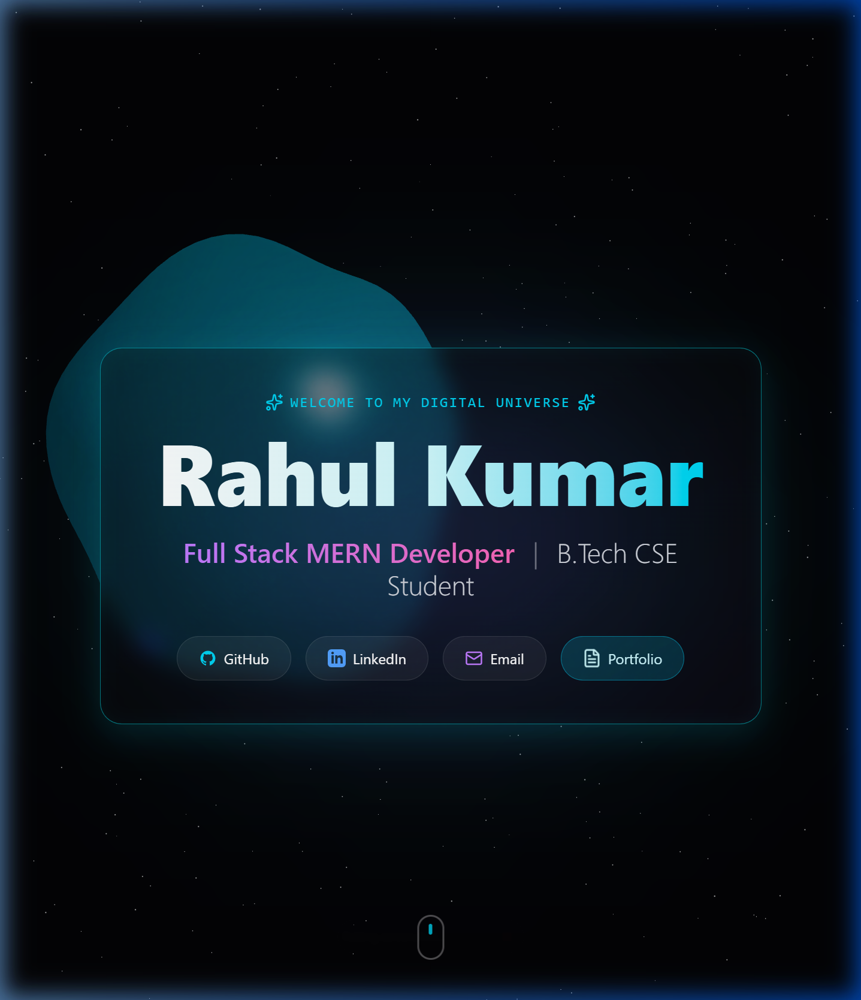

  

  # Hi there, I'm Rahul Kumar 👋
  **Full Stack MERN Developer | B.Tech CSE Graduate**

  🚀 **[Check out my live site!](https://rahul11f.github.io/Git-Profile-Dashboard/)** 🚀
  
  

  *My Interactive 3D Portfolio Dashboard features a live, mouse-reactive starfield, glass-morphism UI, and premium animations built with React & Three.js.*

### 🛠️ Tech Stack

### 📊 GitHub Stats

  

